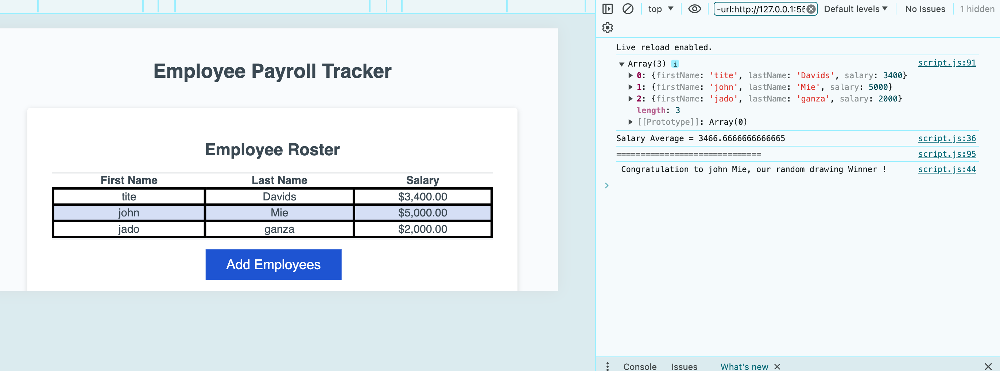

# Employee-Payroll-Tracker
 ## Description
```md 
This Employee Payroll Tracker is a Web application that enables a payroll manager to view and manage employee payroll data. This app will run in the browser and will feature dynamically updated HTML and CSS powered by JavaScript.
```

## Installation
```md
This Web Application will be hosted and will not require any installation. The clients will require to have a digital device that have a browser such as google Chrome, Mozilla firefox and so on.

```
## User Story

```md
AS A payroll manager
I WANT AN employee payroll tracker
SO THAT I can see my employees' payroll data and properly budget for the company
```

## Usage
To use Employee Payroll Tracker, the manager will follow the following instruction:

* GIVEN an employee payroll tracker
* WHEN I click the "Add employee" button
* THEN I am presented with a series of prompts asking for first name, last name, and salary
* WHEN I finish adding an employee
* THEN I am prompted to continue or cancel
* WHEN I choose to continue
* THEN I am prompted to add a new employee
* WHEN I choose to cancel
* THEN my employee data is displayed on the page sorted alphabetically by last name, and the console shows computed and aggregated data

## Mock-Up

The following images show the web application's appearance and functionality:




## Credits

N/A

## License

This website uses the license of MTI